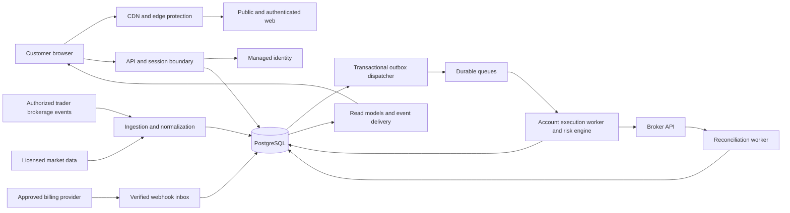

# MirrorTape: production SaaS delivery plan

Prepared September 6, 2026. Based on inspection of this workspace and current primary-source provider/regulatory documentation.

**Confirmed founder decisions:** production domain `mirrortape.net`; Stripe for payments; Alpaca as the first brokerage. The delivery target is the existing production VPS. Cloud-managed hosting in the original architecture table is an alternative only; the VPS deployment contract in [EXECUTION_CONTRACT.md](EXECUTION_CONTRACT.md) takes precedence. Account access, provider commercial approvals, VPS operating details and credentials have not been verified.

**Combined scope:** this roadmap and [EXECUTION_CONTRACT.md](EXECUTION_CONTRACT.md) form one delivery specification. The contract adds all 20 requested features, the Review → Build → Fix → Chromium Test → Verify loop, and the hardened VPS deployment pipeline. None of those features may be omitted merely because it was absent from this initial roadmap.

**Status: planning complete; product implementation is not production-ready.** This document specifies the work and evidence needed to change that status. It does not certify the current product, establish its legal status, or represent provider approval.

## 1. Outcome and scope

Build a deployable subscription SaaS that lets eligible customers connect a supported brokerage account, discover real participating traders, authorize stock and options mirroring within explicit limits, inspect actual order activity and performance, pause copying, manage exposure, and manage their subscription. Operate it with monitoring, incident response, tested recovery, customer support, and defensible marketing claims.

Planning assumptions, pending the founder's answers:

- Initial audience: eligible adult US customers trading US stocks/ETFs and listed options; no crypto. Eligibility is an application policy backed by the approved business model, not merely an IP-location check.
- First public paid release includes real execution. Broker paper trading and a controlled live pilot are validation stages, not substitutes for the final product.
- Start integration work with Alpaca, as selected by the founder. Use Connect/OAuth for existing customer brokerage accounts, subject to validating the approved commercial arrangement. Selection is not evidence of a contracted or approved partner relationship. Other brokers require separate commercial and technical qualification.
- Preserve the current React/TypeScript design and terminal aesthetic. Introduce backend services and replace unsupported behavior incrementally.
- All capabilities sold at launch must be complete. The current claims about five brokers, unlimited mirroring, options flow, trader compensation, and public API/webhooks cannot survive in pricing or marketing without delivery and acceptance evidence.
- No budget, launch date, legal entity, provider agreements, existing trader supply, or production infrastructure has been verified. Estimates below assume these must be established.

**Meaning of no placeholders:** no fake accounts, returns, fills, balances, connected states, success messages, uptime, reviews, counters, legal pages, or dormant paid features in the customer product. An empty state backed by a real query is valid. A real broker paper account is valid when clearly labeled and isolated from live accounts. Test fixtures remain necessary but never supply production results. The existing public simulation should be retired from the launch build; any later educational simulator needs separate explicit scope and review.

**Completion is conjunctive:** deployable code + provider eligibility + operational proof + accurate public claims + staffed support. Completing only the frontend, or even a successful deployment, does not satisfy this plan.

## 2. Verified starting point

### Local quality baseline

| Check | Observed result | Implication |
|---|---|---|
| Repository | Workspace and `app` are not Git checkouts | Establish version control and protected review/release workflow |
| Application | React, TypeScript, Vite, Tailwind; npm lockfile | Keep npm and existing component conventions |
| Runtime used | Node 24.18.0, npm 11.16.0 in the preceding startup | Pin and verify supported versions in local setup and CI |
| `npm run build` | Passed again during this audit; TypeScript build included | Frontend compiles; no proof of SaaS/trading functionality |
| Build output | JS 775.49 kB / 241.61 kB gzip; CSS 102.28 kB / 17.11 kB gzip | Route splitting and a measured frontend budget are needed |
| Build warnings | Old browser dataset, ambiguous `duration-[250ms]`, oversized JS chunk | Resolve causes and record deliberate budget exceptions |
| `npm run lint` | Failed: 17 errors, 0 warnings | Existing React lifecycle/purity and mixed-export issues must be resolved |
| `npm audit --json` | 16 reported vulnerable packages: 12 high, 2 moderate, 2 low | Triage build and runtime paths separately; audit count is not proof of exploitability |
| `npm audit --omit=dev --json` | 1 high finding, `lodash` | Trace dependency usage and upgrade/replace the affected chain with regression checks |
| Automated tests | No test script or test suite found in inspected project | Introduce behavior-focused tests and release gates |
| Deployment assets | No backend, schema/migrations, CI workflow, Dockerfile, or infrastructure definition found | Deployment and operations are new work |

Raw local evidence is saved in [docs/production-audit](docs/production-audit/README.md). Audit results are a dated snapshot and must be refreshed for the release artifact. No dependency remediation was performed as part of creating this plan.

### Code-backed gap inventory

| Area | Current evidence | Required replacement |
|---|---|---|
| Authentication | `app/src/components/Navbar.tsx`: Log in navigates to `/demo` | Authentication, account recovery, MFA, session management, server authorization |
| Purchase | `app/src/pages/pricing/TierCards.tsx`: buttons navigate to `/demo` | Approved processor checkout, server-side entitlements, billing portal and lifecycle |
| Copying | `app/src/components/CopyButton.tsx`: local state displays Copied after optional callback | Durable copy agreement and confirmed execution state; errors cannot appear successful |
| Trader subscription | `app/src/pages/traders/TraderDrawer.tsx`: sets copied handle locally | Server authorization, broker/policy validation, persisted subscription and audit record |
| Broker link | `app/src/pages/home/HowItWorks.tsx`: chip changes connected state locally | Provider authorization callback, account discovery and verified connection health |
| Market data | `app/src/lib/marketEngine.ts`, `app/src/hooks/useSimulatedMarket.ts` | Licensed ingestion, freshness, sequence tracking, reconnect/backfill and entitlement checks |
| Trader records | `app/src/pages/traders/data.ts`: explicitly static plausible data | Consent-based onboarding, real imports, reproducible statistics and provenance |
| Platform proof | `app/src/pages/home/StatsStrip.tsx`: $412M, 1,208 traders, 38 ms, 99.98% constants | Observed metrics with definitions, period, sample size and review; omit until supported |
| Latency | `app/src/pages/demo/AppBar.tsx`: random latency | Measured source, receipt, decision, submission, acknowledgement and fill timestamps |
| Positions/alerts | `app/src/pages/demo/RightRail.tsx`: simulated positions and timed alerts | Broker-backed views, actual account events and delivery records |
| Risk | `app/src/pages/risk/KillSwitchDemo.tsx`: visual simulation | Server-enforced risk policies and cancel/close reconciliation |
| Security claims | `app/src/pages/risk/SecurityGrid.tsx`: vault/encryption/audit assertions | Implement and verify controls before publishing those assertions |
| Market calendar | `app/src/lib/marketHours.ts`: weekday and clock only | Authoritative sessions, holidays, early closes, halts and asset-specific hours |
| Legal/company routes | `app/src/components/Footer.tsx`: unrelated route aliases | Real approved documents and contact workflow; omit irrelevant navigation |
| Error route | `app/src/pages/Placeholder.tsx`: under-construction message | Finished accessible 404 with recovery navigation and correct HTTP behavior |
| Public positioning | `app/index.html`, FAQs and sales pages | Claims tied to approved capabilities; legal identity and status verified |

The original [plan.md](plan.md) expressly scoped a marketing landing and in-browser simulated data. That explains the current architecture. It is not evidence of an implemented trading service.

## 3. Decisions and external gates

Resolve these in the first delivery phase. Work on safe internal foundations can continue while commercial/legal review proceeds; do not collect payment or enable customer live execution before the relevant gates clear.

| Decision | Proposed direction | Owner | Evidence needed to close |
|---|---|---|---|
| Business model and jurisdiction | US-first, subscription access to approved copy-trading service | Founder + securities counsel | Written analysis of adviser/broker implications, registration or partner route, states/customer eligibility, operational obligations |
| Legal identity and branding | Validate MirrorTape name, entity and domain | Founder + counsel | Entity details, trademark/domain review, ownership of source and visual assets |
| Broker arrangement | Alpaca selected; validate Connect for existing customer accounts | Trading lead + founder | Written commercial approval, permitted automated copying model, scopes, account types, rate limits, service/support terms |
| Leader source | Real opted-in traders with broker-derived history | Product + trading operations | Signed participation/data permission, approved compensation and surveillance process |
| Data licensing | One authorized stock/options vendor with redistribution rights | Founder + data lead | Display/non-display/API/export/historical rights, subscriber reporting and recurring cost schedule |
| Payment processing | Stripe selected; obtain approval for the actual financial business | Founder + finance | Written underwriting outcome for subscriptions and any trader payouts |
| Launch instruments | Explicit broker-supported equity and options strategy matrix | Trading/risk lead | Order semantics, customer permissions, tested lifecycle and liquidity/capacity limits |
| Pricing and trader compensation | Replace guessed economics with bounded plans | Founder + finance + counsel | Per-account data fees, execution workload, payout economics, taxes and refund terms |
| Infrastructure and budget | Managed regional deployment with tested recovery | Engineering + operations | Region/residency choice, load model, service quotes, limits and operating owner |

Automated advice can fall within investment-adviser obligations; saying “not an investment advisor” does not resolve classification. Obtain advice on the actual service and compensation structure. SEC guidance discusses disclosure, client information and compliance programs for robo-advisers. [SEC robo-adviser guidance](https://www.sec.gov/investment/2017-02-robo-advisers)

Alpaca's Connect documentation explicitly requires disclosure and written approval for commercial applications. Do not confuse access to a paper endpoint with approval to operate this SaaS. [Alpaca Connect](https://docs.alpaca.markets/us/docs/about-connect-api)

Market-data access and customer redistribution are separate questions. Contract coverage must include the actual display and automated-use model. [NYSE vendor documents](https://www.nyse.com/connectivity/documents), [OPRA document library](https://www.opraplan.com/document-library)

Stripe lists investment and brokerage services among restricted financial businesses requiring review; it is a candidate, not an assumed entitlement to process payments. [Stripe restricted businesses](https://stripe.com/legal/restricted-businesses)

## 4. Release contract and sequencing

### Required for the final public paid product

1. Genuine signup/login/recovery; verified customer identity and eligibility to the extent required by the approved broker and business model; MFA before live authorization.
2. Broker connection, revocation and reconnect; account permissions, health and last reconciliation visible.
3. Real trader profiles, methodology and accurately labeled performance history; no invented social proof.
4. Copy setup with allocation, supported strategy, loss limits, slippage policy, review and explicit authorization.
5. Durable stock and options execution for the approved strategy set, with per-account risk and complete lifecycle handling.
6. Live account dashboard, watchlists, charts, positions, orders, fills, audit history and actionable alerts.
7. Pause new copying, cancel outstanding copied orders, and separately request closure of attributable copied exposure.
8. Licensed options-flow capability if sold; otherwise remove it from the paid offer before launch.
9. Payment, upgrade/downgrade/cancel, invoices, refund handling and entitlement reconciliation.
10. Account settings, security activity, notifications, support, privacy/export/closure and genuine legal documents.
11. Operator tools, incident response, deployment/rollback and recovery evidence.
12. Public API and outbound webhooks if retained in the Pro tier. No checkout for undelivered benefits.

### Narrow capability is allowed; incomplete behavior is not

Validate execution first on one broker and long-only equities. Add eligible listed options before marketing a stocks-and-options product. Each supported options strategy must have complete entry, exit, exercise/assignment/expiration and recovery behavior. Never submit only part of an unsupported spread. If a strategy is unsupported, explain why before authorization and reject it at the server.

The current five-broker list is a proposed integration backlog. A one-broker launch must clearly list that one broker. If the founder requires all five for the first public release, the integration and certification work for all five becomes mandatory and extends the schedule.

Do not offer “unlimited” followers, traders, streams, or API calls before proving workload economics and provider capacity. Publish meaningful limits. Removing an unsupported claim is scope correction, not implementation of that capability.

### Validation stages

| Stage | Audience | Funds and data | Exit evidence |
|---|---|---|---|
| Internal integration | Engineering/operators | Isolated fixtures and real provider sandbox | Contract tests, recovery tests, complete workflows |
| Paper acceptance | Invited evaluators | Real broker paper accounts, entitled data | At least 20 trading sessions; reconciliation and failure evidence |
| Restricted live pilot | Explicitly approved eligible participants | Capped live exposure, contracted providers | At least 20 trading sessions with staffed operations and no unresolved safety-critical defect |
| Public paid launch | Eligible public customers | Real approved service | All final gates in section 14 passed |
| Marketing expansion | Successively larger eligible cohorts | Same controls, larger capacity envelope | Stable operations and economics at each increase |

Elapsed time alone never clears a gate. Paper does not prove live liquidity or full options lifecycle behavior; use separately authorized live certification and documented provider evidence.

## 5. Proposed implementation architecture

Use a modular TypeScript backend with independently deployed API and worker processes. Keep domain code together and extract services only when measurement or isolation needs justify it. Financial decisions must remain deterministic and auditable.

| Component | Proposed implementation | Purpose and constraint |
|---|---|---|
| Web | Existing React/TypeScript app; split public and authenticated route bundles | Reuse design; prerender public marketing routes for metadata/SEO; no private data in static output |
| API/BFF | Node LTS + Fastify, versioned schemas/OpenAPI | Session boundary, input validation, tenant authorization, commands and read models |
| Identity | Managed OIDC provider; Cognito is the default candidate on AWS | Own application authorization and trading eligibility even when identity is outsourced |
| Transaction store | PostgreSQL on RDS Multi-AZ | Users, policies, order intents, executions, outbox, billing, reconciliation and audit metadata |
| Async work | SQS queues + PostgreSQL transactional outbox | Durable jobs, bounded retries, dead-letter handling and replay with safety checks |
| Execution worker | Dedicated Node process, partitioned by brokerage account | Account serialization, broker rate limits, risk reservation, submission and reconciliation |
| Data ingestion | Dedicated provider connections and normalized market/account events | Shared authorized subscriptions, backfill, freshness and source timestamps |
| Realtime delivery | Authenticated SSE for server-to-browser events; commands over HTTPS | Cursor replay, tenant authorization, bounded buffers and resnapshot after gaps |
| Ephemeral distribution | Managed Redis/Valkey only where streaming fanout/cache requires it | Never authoritative for orders, risk reservations or correctness-critical locks |
| Object storage | Encrypted S3, restricted retention-protected audit archive | Approved history imports, exports, backups and evidence with retention policy |
| Secrets | Secrets Manager/KMS with narrowly scoped worker access | Provider credentials and customer tokens isolated from browsers and normal API roles |
| Hosting | CloudFront/S3 public assets; ALB + ECS Fargate API/workers | Separate autoscaling for website traffic, APIs and trading workers |
| Delivery | GitHub Actions OIDC + declarative infrastructure | Reproducible images, reviewed migrations, release approvals and rollback |
| Observability | Structured JSON logs, OpenTelemetry traces, CloudWatch alerts, client error reporting | Redact credentials and private financial data; link events with internal IDs |

This stack is a design recommendation, not provisioned infrastructure. Fargate supplies managed container execution; RDS Multi-AZ provides database failover options. Queue delivery still requires application idempotency. [AWS Fargate](https://docs.aws.amazon.com/AmazonECS/latest/developerguide/AWS_Fargate.html), [RDS Multi-AZ](https://docs.aws.amazon.com/AmazonRDS/latest/UserGuide/Concepts.MultiAZ.html), [SQS delivery semantics](https://docs.aws.amazon.com/AWSSimpleQueueService/latest/SQSDeveloperGuide/standard-queues-at-least-once-delivery.html)

Validate Fastify request/response schemas and keep schemas application-controlled. Managed MFA still requires careful onboarding and federated-session policy. [Fastify validation](https://fastify.dev/docs/latest/Reference/Validation-and-Serialization/), [Cognito MFA behavior](https://docs.aws.amazon.com/cognito/latest/developerguide/user-pool-settings-mfa.html)



Suggested repository layout after an incremental move, using npm workspaces:

```text
app/                        Existing frontend, progressively integrated
services/api/               Sessions, customer commands, read APIs, operator APIs
services/worker/            Ingestion, execution, reconciliation, billing, notifications
packages/contracts/        Versioned request/event schemas and generated clients
packages/domain/           Risk, sizing, performance and order state machines
packages/database/         Schema, migrations, queries and transactional helpers
packages/brokers/           Concrete broker adapters and conformance tests
packages/observability/     Logging, tracing and safe redaction
tests/integration/         Real ephemeral database and queue integration tests
tests/e2e/                 Browser/customer/operator acceptance
tests/resilience/          Fault injection, replay, failover and restore tests
infra/                     Declarative staging/production infrastructure
docs/                      Architecture decisions, operations, compliance evidence
.github/workflows/         Quality gates, build, deploy, release evidence
```

Dependencies are proposed only; no library or infrastructure installation is authorized by this document. Pick supported versions when implementing, justify additions, pin runtime/container versions and regenerate the lockfile consistently.

## 6. Data model and invariants

Use schema migrations, UTC timestamps, stable IDs, foreign keys and explicit tenant ownership. Currency amounts, prices, quantities and fee arithmetic use defined decimal precision and rounding, not JavaScript binary floating point. Include provider identifiers and schema versions in imported records.

| Domain | Principal records | Required invariants |
|---|---|---|
| Identity | users, memberships, roles, sessions, consent_acceptances | Every resource access checks ownership/role; version and time of accepted consent retained |
| Brokerage | broker_connections, brokerage_accounts, account_permissions, account_snapshots | Paper/live mode immutable for an account record; external ID unique within provider and environment |
| Traders | trader_profiles, source_accounts, verification_reviews, participation_agreements | Only authorized real participants publish; verification is evidence-backed and revocable |
| Market data | instruments, option_contracts, sessions, quotes, ingestion_cursors | Source/event/receipt time and entitlement known; corrected and stale data distinguished |
| Performance | source_fills, cash_flows, corporate_actions, equity_snapshots, performance_runs | Metrics reproducible from versioned inputs; revisions preserve history |
| Copy agreements | copy_subscriptions, policy_versions, account_control_state | Server validates eligibility; policy revision and activation start boundary explicit |
| Execution | source_events, signal_intents, follower_intents, risk_decisions, reservations, orders, order_events, fills | Unique source-event/follower/action identity; atomic reservation; no inferred fill from submission |
| Attribution | copied_lots, lot_allocations, manual_adjustments | Never close more attributed quantity than actually held; manual positions cannot silently become copied |
| Recovery | reconciliation_runs, discrepancies, inbox_events, outbox_events, worker_leases | Events durable before acknowledgement; replay cannot generate a duplicate economic action |
| Billing | customers, subscriptions, invoices, payment_events, entitlements | Unique provider event; no entitlement based solely on browser return URL |
| Trader payouts | accruals, payout_batches, payout_events, tax_status | If compensation is offered, accrual basis and reversals reconcile to actual billing |
| Support/audit | audit_events, incidents, support_cases, notification_deliveries, export_jobs | Sensitive actions attributable; retention and deletion rules enforced |

The broker is authoritative for executions and account holdings. The application owns copy intent, authorization, attribution and evidence. Differences generate a discrepancy state and can block new exposure; never overwrite them to make the dashboard look healthy.

Use PostgreSQL row locks/transaction isolation and durable reservations to serialize account exposure. A queue partition or expiring distributed lock alone is insufficient. Worker ownership uses fencing/generation checks. Multiple runtime replicas must not mean multiple simultaneous order writers for the same account.

## 7. Trading behavior specification

### 7.1 Source signal and copy semantics

- Capture actual consenting leader brokerage events. Store original IDs, payload hash, source account, event timestamp, receipt timestamp and sequence/cursor.
- Default to fill-derived mirroring: confirmed leader fills produce follower intents. Do not claim leader-order latency when the source is a later fill event.
- Deduplicate partial fills by execution ID and handle broker corrections/busts. Corrections trigger reconciliation and a reviewed adjustment policy; do not blindly create inverse trades.
- Define activation as future eligible events after a durable cutover boundary. Catching up to a leader's existing positions is a separate reviewed workflow, off by default.
- Define deterministic sizing using allocation, authoritative available equity/cash, leader exposure basis, lot sizes, contract multipliers and conservative prices. Validate examples for deposits, withdrawals, leverage differences and tiny accounts.
- Recheck eligibility at execution time: an intent queued while enabled must not bypass a later pause, expired authorization or lowered limit.
- Use a defined source-event expiry. Backlogged signals that are too old are skipped with an explanation, not executed after a restart.
- Reject self-copy, copy cycles, unsupported instruments and conflicting subscriptions. Determine a fair deterministic dispatch policy for followers; measure follower-position effects and avoid promising identical fills.

### 7.2 Pre-trade risk and account controls

Evaluate every live submission on the server using a versioned policy and record the inputs and decision:

1. Customer/session-independent trading authorization, active copy agreement, live eligibility and entitlement.
2. Broker authorization health, account restrictions, instrument permissions and applicable options approval.
3. Data freshness, clock health, authoritative market calendar, halt/tradability and instrument status.
4. Account buying power/cash, pending orders, settled-funds restrictions where applicable and reserved exposure.
5. Per-trader allocation, per-order notional/contracts, account aggregate exposure, underlying/sector concentration and strategy risk.
6. Daily loss/drawdown and high-water-mark policy adjusted for cash flows; define handling of unavailable valuations.
7. Slippage and spread thresholds, limit-price constraints, liquidity and per-instrument participation limits.
8. System/account/trader/symbol pause state, outstanding reconciliation discrepancies and provider rate limits.

Reserve buying power and exposure atomically before dispatch. Include all local pending orders and reconcile external/manual orders. Release or update reservations only on authoritative order state. Re-evaluate after partial fills and price movement. Independent simultaneous signals must not each spend the same available balance.

Risk-reducing actions use their own policy: cancellation and safe attributable closure remain available during a subscription problem or a new-exposure halt. They still require authorization, authoritative holdings, broker permission and valid order semantics. Never equate “risk reducing” with permission to sell arbitrary holdings.

Loss caps and kill switches constrain decisions; they cannot guarantee a fill price or prevent losses through a gap, halt or broker outage. Product copy must describe that limitation accurately.

### 7.3 Durable order state and ambiguous outcomes

Model intent and broker state separately. Intent states include received, ineligible, risk-rejected, reserved, dispatching, outcome-unknown and reconciled. Broker states include accepted, open, partially-filled, filled, cancel-pending, canceled, rejected and expired; support corrections without losing event history.

Critical dispatch sequence:

1. Commit follower intent, risk inputs/policy version, reservation and outbox entry in one database transaction.
2. A worker claims the account with durable fencing, checks current control state and records the submission attempt.
3. Use a stable broker client-order ID tied to the intent where supported and certified.
4. If the request times out, keep the intent outcome-unknown and retain conservative reservation. Query broker order/client ID, executions and account state before deciding whether another send is safe.
5. Retry only when the adapter's tested contract establishes safe behavior. Ambiguity that cannot be resolved automatically pauses affected new exposure and pages operations.
6. Process order/fill streams idempotently and reconcile against authoritative snapshots and history.

Database/queue processing cannot promise exactly-once brokerage execution across a network boundary. Idempotent records, stable identifiers, provider-supported behavior and reconciliation are the design; duplicate economic actions are a release-blocking defect.

### 7.4 Options as a complete lifecycle

- Identify contracts by broker instrument ID and authoritative metadata: underlying, expiration, strike, put/call, multiplier, exercise style and adjusted deliverable. Do not construct real symbols from demo strings.
- Enforce whole contracts, eligible order types, trading session, customer approval and strategy permissions for the selected broker. Alpaca documents distinct approval levels, order constraints and option activity events. [Alpaca options documentation](https://docs.alpaca.markets/us/docs/options-trading)
- Certify single-leg long options first; add covered/cash-secured and defined-risk multi-leg strategies only as explicitly supported. Treat multi-leg ratios as one strategy; never degrade to independent orders that create unintended naked risk.
- Model expiration, early exercise, assignment, underlying delivery, broker liquidation, adjusted contracts and resulting cash/stock positions. Define notification/escalation and exercise/do-not-exercise deadlines with the broker.
- Constrain near-expiry exposure and liquidity using documented policy; support a blocked reason, not a silent substitution to a different expiry/strike.
- Include assignment-created stock exposure in account risk and attribution. Reconcile later-arriving non-trade activities; paper and live event timing can differ.
- Maintain approved loss/exposure definitions per strategy. Broker approval alone does not mean every strategy is safe or supported by MirrorTape.

### 7.5 Pause, cancel and flatten

Expose separate actions with clear effects:

- **Pause copying:** atomically stop new intents for the selected scope and prevent queued intents from dispatching.
- **Cancel copied open orders:** request cancellation and display cancel-pending until confirmed. Handle fills racing with cancellation.
- **Close copied positions:** show attributable holdings, orders to submit and liquidation limitations; require explicit confirmation, then track each close order to a terminal state.

A successful pause response means the server control state is durable. It does not mean in-flight requests were canceled or positions closed. After a pause, reconcile in-flight attempts, stop new entry dispatch and display remaining exposure. A trading account disconnected while exposure remains must get a clear warning and broker-management instructions.

For mixed manual/copied holdings, maintain lot attribution and detect changes made directly at the broker. Prefer a dedicated brokerage account for copying during initial rollout. Any unresolved ownership or quantity mismatch blocks automatic liquidation and requires resolution; never sell unrelated personal holdings.

## 8. Implementation work packages

Each package requires implementation, tests, migration/configuration where relevant, documentation, staging evidence and review. Estimates overlap; they are not additive calendar commitments.

### WP0 — Business feasibility and capability contract

**Owner:** founder, counsel, trading lead. **Dependencies:** none. **Planning allowance:** 2–4 weeks for initial decisions; external approvals can take substantially longer.

Produce the decisions in section 3, the exact supported customer/instrument/broker matrix, data rights, initial pricing economics, trader supply commitments and a claim inventory. Define who owns incident response and customer trade complaints. Review registration/partner structure, privacy, records retention, marketing, compensation, identity checks and customer disclosures for the actual service.

**Acceptance:** written decision record; named owners; provider approval path and documentary requirements; no assumed legal exemptions. An infeasible broker/data/payment model triggers an explicit product decision before integration spending expands.

### WP1 — Repository, quality and repeatable delivery foundation

**Owner:** engineering lead. **Dependencies:** none for local work. **Allowance:** 1–2 weeks.

- Establish Git history after secret/asset review; meaningful package name, runtime pin, npm workspace structure and protected review workflow.
- Correct the 17 lint failures deliberately. Fix impure/lifecycle patterns and split shared exports as appropriate; do not silence the entire rule set to make CI green.
- Triage all audit findings, inspect the runtime lodash chain, upgrade maintained compatible versions and verify regression behavior. Keep build-tool security in scope.
- Review and confine `plugin-inspect-react-code` to development if needed; remove inspection metadata and unnecessary tooling from released assets.
- Add unit/integration/browser test commands, strict type checks, formatting policy, dependency/secret scanning and reproducible build.
- Create configuration schema, non-secret `.env.example`, local setup, test database profile and actionable readiness diagnostics. No production credentials or implicit production endpoints in development.
- Replace template README with actual setup, build, checks and troubleshooting. Record architecture decisions and third-party asset/license provenance.

**Acceptance:** clean install on a fresh checkout, all applicable quality checks pass, CI reproduces the result, no untriaged high/critical findings, no secret in source/history/build. No new application features are claimed from this foundation alone.

### WP2 — Data, service and deployment foundation

**Owner:** backend + operations. **Dependencies:** WP1; infrastructure decisions from WP0. **Allowance:** 2–3 weeks.

Implement PostgreSQL migrations, session/API service, worker lifecycle, transactional inbox/outbox, queue consumers, deterministic retries, lease fencing, structured errors/logging and trace IDs. Set up separate development, staging and production configuration, identities, data and provider endpoints. Add `/health/live`, dependency-aware readiness and worker heartbeat/backlog health.

Deploy staging through infrastructure code using short-lived CI cloud credentials. Include non-root containers, resource limits, graceful shutdown, migration locking, rollback and startup validation. A missing required integration setting must fail readiness or make the relevant capability explicitly unavailable; never switch silently to mock data.

**Acceptance:** rerunnable empty-environment provision/deploy, migration concurrency test, crash after database commit recovered through outbox, duplicate message handled once logically, unavailable database prevents order dispatch, staging rollback demonstrated.

### WP3 — Identity, tenancy and customer lifecycle

**Owner:** full-stack + security reviewer. **Dependencies:** WP2. **Allowance:** 2–3 weeks.

Build signup, email verification, login/logout, MFA enrollment, recovery, session listing/revocation, settings and account closure. Use secure HttpOnly cookies through the API/session boundary, appropriate SameSite/CSRF controls, exact origin policy and OAuth state/nonce/PKCE as supported. Do not store brokerage credentials or durable session secrets in browser storage.

Implement customer, trader, support, operator and compliance roles with least privilege. Enforce resource ownership at every API/export/event-stream boundary; add database isolation defense where appropriate. Security-sensitive changes require recent authentication; emergency pause remains fast for an already authorized session. Recovery cannot quietly bypass live-trading MFA policy.

**Acceptance:** two-tenant adversarial tests across HTTP, events and exports; IDOR tests; expired/revoked sessions denied; recovery and MFA failure paths verified; login CTA reaches real auth; account with incomplete live eligibility cannot authorize execution.

### WP4 — Broker linking, account sync and market data

**Owner:** trading integration + data engineer. **Dependencies:** WP0 approval path, WP2–3. **Allowance:** 3–5 weeks for the first adapter.

Build real OAuth connection/revocation, token custody, account discovery, explicit paper/live account selection and capability inspection. Implement provider-specific token expiry/refresh behavior without assuming every provider supports refresh tokens. Keep data-provider and broker credentials server-side.

Implement asset/contract catalog, licensed quotes/bars, authorized stream fanout, trade/account events, authoritative calendar, reconnect cursors and gap backfill. Persist last successful sync and discrepancy state. Normalize rates and error classes per provider. Do not use browser timers to manufacture liveness. An outage produces unavailable/stale data with its last timestamp.

**Acceptance:** sandbox connection and revocation, rejected callback/state mismatch, revoked/expired permission handling, disconnect/reconnect/backfill, duplicate/out-of-order events, early close/holiday cases, wrong data entitlement denied, no paper credential accepted by live workers. Record commercial permissions before public activation.

### WP5 — Real trader supply and trustworthy analytics

**Owner:** trading/data lead + product + compliance. **Dependencies:** WP0, WP4. **Allowance:** 3–5 engineering weeks; history and recruitment can determine the launch date.

Build trader application, identity/ownership verification, participation agreement, approved import pipeline, review/rejection/suspension and profile publication. Validate source history, timestamps, corrections and gaps; imported statements require secure file validation, size limits, malware scanning and provenance.

Define return methodology including time-weighted versus money-weighted values, cash flows, fees, dividends, splits, closed and open PnL, mark freshness, benchmarks, drawdown, annualization, win-rate denominator and multi-leg trade grouping. Publish methodology and coverage, distinguish leader performance from follower results, and retain methodology/input versions. Require enough actual history for every advertised period; missing history is unavailable, never annualized into an invented track record.

Build real search/filter/pagination, equity curves, follow counts and capacity limits. Review concentration, thin-market manipulation, leader conflicts, strategy drift and follower crowding. Suspend a trader's new copying independently of customer portfolio visibility. Design fair follower dispatch and disclose slippage differences.

If paying traders, implement approved contracts, accruals, chargeback/refund adjustments, payout reconciliation, onboarding/tax requirements and conflict disclosures. No fake earnings dashboard or promised payout without a payment rail.

**Acceptance:** independently calculated financial test cases match; corrections reproduce revised metrics; unverifiable profiles stay unpublished; every badge and headline has source evidence; real participating traders exist before marketplace launch. “Audited” requires an actual defined audit/review process, not just a verification icon.

### WP6 — Copy agreements and equities execution

**Owner:** trading/backend engineers. **Dependencies:** WP3–5. **Allowance:** 4–6 weeks.

Implement the semantics and state machines in section 7 for supported equities. Build allocation setup, review/consent, activation cutover, pause/resume, copy capacity, reserved buying power, stable order identity, slippage/price policy, cancellation, fills, attributed lots and reconciliation. Preserve a versioned immutable audit trail for each decision and change.

**Acceptance:** broker paper end-to-end execution with true persisted results; retry/crash never duplicates economic actions; manual account changes are detected; lower limits take effect on queued work; inability to establish safe state blocks new exposure. Test adversarial scenarios from section 10 before live certification.

### WP7 — Options execution and lifecycle

**Owner:** trading/risk specialists. **Dependencies:** WP6 and options-enabled adapter/data. **Allowance:** 4–6 weeks, partly overlapping later WP6 work.

Deliver the options strategy matrix and full lifecycle in section 7.4. Integrate order permissions, contract discovery, strategy exposure, expiry management, exercise/assignment activities and resulting stock positions. Add strategy-aware explanations and customer approval review. Validate live/paper differences through broker conformance evidence and an explicitly authorized pilot.

**Acceptance:** supported strategies pass entry, partial fill, cancel, close, expiry, assignment, early exercise, adjustment and recovery scenarios. Unsupported strategies fail before submission. No legging fallback, naked exposure surprise or demo-derived contract identifier.

### WP8 — Account dashboard and customer workflows

**Owner:** frontend/full-stack. **Dependencies:** WP3–7 APIs; can integrate incrementally. **Allowance:** 3–5 weeks.

Convert the demo terminal into the authenticated account product. Separate viewing a live account from authorizing copying. Integrate watchlists, charts, positions, orders/fills, trader subscriptions, policy editing, PnL, audit history, alerts and account health with real server contracts.

Implement loading/empty/error/stale/success states, reconnect/resnapshot, pagination, timezone display, keyboard navigation, mobile layouts, screen-reader labels and reduced motion. Success indicators must correspond to committed server state; order submission is not a fill. Preserve focused user input during streaming updates. Sensitive live events must not reach another user's stream after reconnect or revocation.

**Acceptance:** complete customer journeys on desktop and mobile; reload retains settings and subscriptions; expired sessions recover safely; all actions and errors accessible; browser automation proves server-side outcomes; public simulation modules are absent from paid/live route bundles.

### WP9 — Billing, entitlements and commercial operations

**Owner:** full-stack + finance. **Dependencies:** WP0 processor approval, WP3, capability/pricing contract. **Allowance:** 2–3 weeks.

Implement server-created checkout, one authoritative product/price catalog, provider customer linkage, signed webhook inbox, subscription and invoice reconciliation, billing portal, cancellations, refunds, failed payments, tax handling and auditable support adjustments. Derive entitlements from durable provider-confirmed state. Handle duplicated and out-of-order events; Stripe explicitly documents these realities. [Stripe webhook documentation](https://docs.stripe.com/webhooks?lang=node)

Define downgrade behavior for excess active trader subscriptions and limits. Delinquency may stop new copying according to disclosed policy, but must not silently liquidate holdings or remove position visibility, cancellation and essential risk-reduction controls. A payment-provider outage cannot sit directly on the per-order execution path; use durable entitlement state with a bounded documented outage policy.

**Acceptance:** sandbox purchase/renewal/cancel/refund/dunning and event replay; no checkout-return spoof grants access; no duplicate charge/entitlement; outage recovery reconciles accounts; approved live processor activation and consented live billing verification before public sales.

### WP10 — Options flow, public API and webhooks

**Owner:** data/backend + security. **Dependencies:** WP0 data rights, WP4–7, WP9 entitlements. **Allowance:** 3–5 weeks if retained in the paid offer.

Replace options-flow rows with a licensed source and defined classification. Define block/sweep/size calculations, correction treatment and timestamp semantics. Do not infer a leader identity from anonymous market-wide prints; distinguish leader activity from general market flow. Validate data cost and redistribution rights before advertising it.

For an advertised public API, implement versioned scopes, hashed API credentials where usable, per-tenant limits, rotation/revocation, pagination, idempotency and actual OpenAPI examples. Scope the first API to documented reads unless external trading commands are separately specified and certified. Outbound webhooks need event IDs, HMAC signing, replay timestamps, retry/dead-letter UI and delivery history. User-defined destinations require SSRF defenses, blocked private/link-local/metadata ranges, DNS-rebinding protection, safe redirects and tightly controlled egress. Market-data exports/API redistribution require contractual coverage.

**Acceptance:** real eligible customer integration succeeds; revoked keys fail; tenant isolation and quotas hold; malicious webhook destinations fail; duplicate delivery is documented and testable; all marketed classifications reproduce from actual inputs.

### WP11 — Security, operations and customer support

**Owner:** operations + security + support. **Dependencies:** starts WP2, completes after WP7–10. **Allowance:** 3–5 weeks of focused hardening plus ongoing work.

Build dashboards and runbooks for broker/data outages, auth compromise, account discrepancy, stuck order, queue lag, payment failures and deployment incidents. Provide controlled operator actions with role checks, reason codes and audit trails. Support defaults to read-only; token access and arbitrary customer trading are not routine support privileges. Dangerous live operations require explicit authorized review.

Threat-model account takeover, cross-tenant leakage, token exfiltration, forged leader events, duplicate execution, account-level race conditions, market manipulation and operator abuse. Implement secret access boundaries, encryption policies, content security policy, HSTS once HTTPS is verified, CORS/CSRF controls, upload and webhook validation, rate limits and safe logs. Scan repository, image and client bundles; commission independent penetration and trading-risk review and fix findings.

Build real support/contact routes, case tracking, incident communication, refund/dispute procedures, complaint escalation and customer broker fallback instructions. Implement export and closure with legal retention holds, token revocation, cancellation policy and confirmation of remaining live exposure. Deletion requests cannot erase records that must be retained; define restricted retention and access instead.

**Acceptance:** staged incident drill, permission tests, token-revocation exercise, support case through resolution, monitored notifications with bounce/retry behavior, independent review findings closed to launch standard, restore drill and fenced trading recovery passed.

### WP12 — Public site, compliance review and acquisition readiness

**Owner:** product/design + growth + counsel + engineering. **Dependencies:** verified capabilities and WP9–11. **Allowance:** 2–4 weeks.

Replace every fabricated statistic and guarantee. Align home, pricing, FAQ, trader pages, risk pages, metadata, social images and screenshots with the shipped capability matrix. Correct legal identity/year and security statements; remove unsupported broker logos and irrelevant document links. Create genuine Terms, Privacy, risk/options disclosures, billing/refund terms, methodology, About, Contact, help and status destinations. Deliver a finished 404 and correct HTTP status handling.

Prerender public routes, configure canonical URLs, sitemap, robots, route-specific metadata and meaningful social previews. Keep private app routes non-indexable; enforce authentication regardless of robots settings. Optimize fonts, charts and animation initialization; lazy-load the terminal and keep marketing traffic separate from execution capacity.

Instrument consent-aware acquisition/onboarding events without brokerage balances, account numbers or holdings leaking to ad pixels. Test consent, unsubscribe and transactional email boundaries; configure SPF/DKIM/DMARC and verify deliverability. Establish approved creative, substantiated testimonials, affiliate/conflict rules, campaign targeting, funnel dashboards and support capacity.

Investment-adviser marketing requirements, when applicable, constrain performance and testimonial presentations. A simulation label alone is not a blanket permission for hypothetical performance advertising. Have counsel approve the actual claims and evidence. [SEC marketing guide](https://www.sec.gov/resources-small-businesses/small-business-compliance-guides/investment-adviser-marketing)

Advertising platforms also have financial-services and location-dependent eligibility policies. Verify the exact campaign/account/target-country requirements before spending. [Google financial-products advertising policy](https://support.google.com/adspolicy/answer/2464998?hl=en)

**Acceptance:** every navigation item and CTA completes its named action; claims register signed off; live prices and checkout match; production legal/contact pages exist; accessibility/performance checks pass; analytics and consent verified; campaign drafts approved before spend.

## 9. Reliability, performance and capacity contract

These are proposed internal launch targets, not existing measurements or customer guarantees. Validate and revise them before pricing and publishing any SLA.

| Measure | Proposed acceptance target | Method |
|---|---|---|
| Public/API availability | 99.9% monthly for defined owned endpoints | External probes + request success/error budget; report provider outages separately without hiding customer impact |
| Financial correctness | Zero unresolved duplicate economic actions, tenant leaks or unexplained execution discrepancies | Deterministic fault tests plus paper/live pilot reconciliation |
| Standard API latency | p95 <300 ms for owned reads, excluding separately reported provider calls | Production-shaped load with realistic data and queries |
| Signal processing | p95 <1 s from platform receipt to broker submission attempt for eligible traffic inside the certified capacity envelope | Trace stages; publish actual numbers only after measurement, no inherited 38 ms promise |
| Pause acknowledgement | p95 <1 s for durable control update on healthy owned infrastructure | Prove queued work obeys pause; measure in-flight cancellation separately |
| Market UI updates | p95 <2 s from entitled source receipt to display | Compare timestamps and gaps; upstream delays separately visible |
| Stale-data behavior | Explicit per-feed age threshold; block new exposure if required state is unsafe | Inject feed stalls; no fabricated fresh timestamps |
| Reconciliation | Streams continuously; periodic full/open-order scans within a quota-approved schedule; daily close reconciliation | Define maximum detection lag per broker, page before exceeding it |
| Public page UX | p75 LCP ≤2.5 s, INP ≤200 ms, CLS ≤0.1 on target mobile cohort | Lab budget before launch; real-user measurement after launch |
| Recovery | Initial target RPO ≤5 min and RTO ≤60 min for regional application disaster | Measured restore exercise; trading remains paused until broker reconciliation completes |
| Operational response | Safety-critical alert acknowledged within 5 minutes during supported live operation | Staffed rotation and incident drill, with escalation/fallback |

Regional database restore may lose recently committed local intent records even if the broker executed them. Recover using broker order IDs/history plus retained event evidence; never replay recovered queues into trading before reconciliation. If this cannot establish safe ownership/state, remain paused. A backup target is not permission to lose track of economic actions.

Initial **load-test envelope**, subject to commercial quotas: 100,000 public page visits/day, 5,000 concurrently connected terminals, 1,000 connected brokerage accounts, and a popular source event generating up to 1,000 follower decisions. Simulate a 3× short burst and at least 8 hours of market-session load. These are sizing hypotheses, not verified capacity.

At 1,000 followers, even one leader event can require 1,000 independent broker submissions. Measure provider quotas and fair dispatch before accepting that many followers. Capacity caps, backpressure and signal expiry are required; more containers cannot overcome a broker's rate limit or a thin market. Certify the sub-second target only for an explicitly supported cohort size and traffic envelope.

Scale and isolate public CDN, auth, market streams, worker pools and database connections independently. Partition execution by account, cap concurrent work per provider and use bounded pagination/buffers. Add circuit breakers and exponential backoff with jitter for retriable reads; never apply generic retries to uncertain order submission. Run no live trading load tests without specific broker and account authorization.

## 10. Verification matrix

| Layer | Required cases | Pass condition |
|---|---|---|
| Unit/property tests | Decimal sizing, lots, fees, cash-flow-adjusted performance, drawdown, risk aggregation, order transitions | Known financial examples and invariants match; every branch of critical risk/state logic exercised |
| Database integration | Tenant checks, reservations, inbox/outbox, migrations, unique keys, rollback/concurrency | Concurrent signals cannot overspend or duplicate intent; partial commits recover |
| Broker conformance | OAuth, permissions, IDs, fills, cancels, rate limits, pagination, corrections | Observed behavior documented against each supported broker/environment |
| Webhooks/streams | Invalid signature, duplicate/reordered event, lost connection, cursor gap, replay | Reject forgery; recover actual state without duplicates or cross-tenant leakage |
| Execution fault injection | Timeout after broker acceptance; worker death before/after send; database failure; stale lock holder | Outcome stays explicit; no blind retry; safe reconciliation/hold |
| Risk races | Two leaders spend same cash; limits lowered mid-queue; pause races submission; external manual order | Atomic accounting and dispatch recheck prevent new unauthorized exposure |
| Position attribution | Same symbol copied from two leaders plus manual holdings; external sale; corporate action | Correct remaining lots; no unrelated holding sold |
| Options | Partial spread fills, rejection, expiry, assignment, exercise, adjusted multiplier, halted underlying | Complete strategy lifecycle or explicit safe rejection/escalation |
| Market/calendar | Weekend/holiday/early close/DST, halt, stale bid/ask, missing quote, corrected print | Correct eligibility/freshness state; no invented market availability |
| Customer E2E | Signup → MFA → connect → choose trader → policy → paper/live authorized flow → pause → billing → closure | Persisted provider/server evidence matches every displayed outcome |
| Billing | Forged checkout return, duplicate/out-of-order events, dunning, cancel, downgrade, refund, processor outage | Correct durable access and invoices; essential risk controls remain reachable |
| Security | IDOR, role abuse, CSRF/XSS, session revocation, OAuth replay, webhook SSRF, export leakage | No cross-tenant/privilege breach; all high-risk operations audited |
| UI/accessibility | Keyboard, focus, screen reader, mobile, reduced motion, slow/offline network | Core journeys usable; failures actionable and truthful |
| Load/soak | Open-market burst, high fanout, 8-hour stream, DB/queue pressure, noisy tenant | Defined SLOs/caps hold, bounded memory, no lost/duplicated economic action |
| Disaster/release | DB restore, broker outage, region failover, migration rollback/forward fix, stale queue replay | Restore measured; writers fenced; no trading until reconciled |

Use deterministic fixtures for isolated tests and real services/sandbox for integration evidence. Mock-only passing tests cannot satisfy broker integration. Coverage percentages are supplementary; a high percentage that misses the timeout-after-acceptance case is insufficient.

## 11. Deployment and operational delivery

Provide complete declarative infrastructure for the chosen region, separate environment identities, private database/queue access, managed TLS, narrowly scoped IAM, provider egress, secrets, logs, alarms, backups and budget alerts. Production execution workers run on stable capacity; interruption-tolerant compute is suitable only for noncritical jobs after review.

Required CI/release stages:

1. Lockfile install and approved dependency lifecycle scripts; formatting, lint, typecheck, unit/property tests.
2. Ephemeral database integration, migrations from empty and prior supported schema, broker conformance fixtures and contract validation.
3. Secret/SAST/dependency/license/container scans and software bill of materials.
4. Build once; produce versioned signed/checksummed artifact with commit, configuration schema and migration manifest.
5. Deploy staging; provider sandbox and browser acceptance, accessibility, smoke and selected fault checks.
6. Validate backup and rollback prerequisites; review infrastructure and database changes.
7. Promote the same artifact to production under explicit release approval, run owned-service smoke checks and watch error budget/correctness metrics.
8. Enable execution only for a certified cohort and current policy version; record release evidence and operator handoff.

Use expand/contract database changes and deploy compatible readers/writers. Migration retries are state-aware and serialized. Rollback application code only while schema compatibility is proven; do not blindly reverse data migrations. Never run schema writes on every replica startup.

Deploy execution workers with account ownership/fencing and controlled draining. A blue/green deployment must not create two order writers. A restart or rollback does not reset source-event cursors or replay already executed intents.

Backups require point-in-time recovery, restricted restore roles, scheduled restore drills and an evidence record. Define audit/data retention with counsel and licensing terms; align customer deletion with retained regulated records and backup expiry. Protect broker credentials separately from database exports.

Runbooks must cover: deploy/rollback; stuck outcome-unknown order; position discrepancy; global/account/trader pause; provider outage; token compromise; data-feed gaps; queue/dead-letter inspection; payment incident; database restore; options expiry incident; customer complaint; and operational wind-down if the service closes. Include safe broker fallback instructions and verified support contacts.

## 12. Delivery schedule and staffing

**Planning estimate:** approximately 6–9 months for a staffed first-broker stocks-and-options public launch from this starting point. This is an engineering estimate with substantial uncertainty, not a provider/legal timeline guarantee. Five-broker parity or missing leader history can extend it materially. A single generalist or coding agent cannot replace provider approval, qualified trading review, counsel or live operations.

Assumed team: technical lead; two backend/trading engineers; one frontend/full-stack engineer; one QA/automation engineer; an operations/security engineer (can be fractional early, staffed for pilot); founder/product owner; securities counsel/compliance support; trading operations/customer support by pilot. Individuals may cover multiple roles only where competence and on-call coverage remain adequate.

| Calendar window | Main work | Exit milestone |
|---|---|---|
| Weeks 1–3 | WP0 decisions and provider applications; WP1 baseline | Feasible capability contract and repeatable tested repository |
| Weeks 3–7 | WP2–3 foundation/auth; WP4 broker/data integration begins | Staging, real customer sessions, first actual broker account read |
| Weeks 6–12 | WP4–5 ingestion/trader history; WP6 equities | Real paper copy flow with audit and reconciliation |
| Weeks 10–17 | WP7 options; WP8 dashboard; WP9 billing | Complete candidate customer product in sandbox |
| Weeks 14–21 | WP10 if sold; WP11 hardening; WP12 content; paper acceptance | Independent review and paper acceptance gates pass |
| Weeks 20–28 | Authorized live pilot, lifecycle certification and corrective work | Live operational evidence and final launch readiness review |
| Weeks 28–36 | Contingency, remaining approvals, measured rollout and acquisition ramp | Public launch and controlled marketing expansion |

Critical path: approved business/provider model → real leader data and broker integration → risk/execution/reconciliation → options lifecycle → paper and live acceptance → public sales. Billing and public-site improvements can proceed alongside integration but cannot move that path by themselves.

The existing “12 months / 200 fills” verification claims can only remain if each published trader has qualifying authentic history. Do not treat a development schedule as a way to create that history. Import and review historical records where permitted, or publish a truthful shorter observation period after approval.

### Budget model

Do not infer viable pricing from the current $49/$129 cards. Obtain quotes and model:

`monthly operating cost = staff/on-call + counsel/compliance + broker fees + licensed data base fees + subscriber entitlements + compute/database/queues + streaming egress + observability/retention + auth/email/support + insurance + payment fees + trader compensation`

`contribution per paid account = collected subscription revenue - refunds/chargebacks - processor fees - per-account data/broker cost - trader share - marginal infrastructure/support cost`

Calculate break-even paid accounts, gross margin and customer acquisition payback under base, heavy-usage and outage/support scenarios. Add implementation contingency of 25–35% to the agreed labor plan as a planning reserve. Exact dollar budgets require staffing rates, vendor quotes and licensed-user assumptions; no external prices have been asserted here.

## 13. Concrete first implementation sequence

The first engineering phase should produce a reviewable baseline and a real integrated vertical slice, while WP0 progresses.

| Order | Change set | Evidence to deliver |
|---|---|---|
| 1 | Git baseline, package identity, runtime pin, setup docs, claims/capability register | Clean checkout reproduces current app; original state preserved |
| 2 | Resolve lint and vulnerable dependency paths; remove development inspection from release | Lint/type/build and refreshed audited dependency tree |
| 3 | npm workspace, test harness, API/worker skeleton with real health/config validation | Real processes start; invalid config fails clearly; no stub success endpoints |
| 4 | PostgreSQL schema/migrations, tenant boundary, inbox/outbox and structured audit | Real DB concurrency/replay tests and migration evidence |
| 5 | Real identity/session/MFA onboarding and protected app route | Two-user isolation and full browser auth journey |
| 6 | Approved provider sandbox connection, token custody, account snapshot and stale/error UI | Provider request/event evidence linked to actual rendered account state |
| 7 | First consented trader source import and reconciled fill history | Source record → normalized record → reproducible profile statistics |
| 8 | First server-authorized paper copy agreement through intent, risk, broker fill and reconciliation | End-to-end trace plus timeout/duplicate/pause race tests |

Do not populate a temporary fake backend while waiting for credentials. Implement the real adapter and validated unavailable configuration state, complete independent tests, and mark external integration acceptance blocked until genuine provider access exists. Do not sell that blocked capability.

## 14. Final public-launch gates

The release owner assembles a dated evidence packet. Every gate below must pass for the exact deployed version and approved scope; failures remain visible.

| Gate | Required proof | Sign-off owner |
|---|---|---|
| Legal/commercial | Entity, operating model, customer eligibility, required approvals/agreements, data rights, payment approval | Founder + counsel/compliance |
| Product completeness | Every sold feature completes its actual workflow; no fake success, under-construction page, dead CTA or simulation fallback | Product + QA |
| Trading correctness | All critical risk/execution/lifecycle tests pass; no unresolved duplicate action or attribution discrepancy | Trading lead + independent reviewer |
| Data/performance truth | Real trader consent/history, reproducible metrics, licensed data, freshness/provenance UI | Data lead + compliance |
| Security | Tenant/session/secret controls verified; no unresolved critical/high security issue in runtime or delivery chain; independent findings addressed | Security owner |
| Billing | Real approved processor, lifecycle/reconciliation evidence, correct prices/entitlements, support/refund path | Finance + QA |
| Reliability | Capacity/SLO tests, paper/live operational evidence, staffed alerts, no unresolved safety-critical incident | Operations |
| Recoverability | Restore and rollback measured; execution fenced and reconciled before resume | Operations + trading lead |
| Customer readiness | Onboarding, support, email, accessibility, mobile, export/closure and broker fallback verified | Product/support |
| Marketing | Claims register, legal pages, SEO, consent, creative/platform review and budget controls | Growth + counsel |
| Delivery | Versioned artifact, passing CI, documented configuration/migrations, infrastructure and rollback | Engineering lead |

Automate semantic checks for production imports of simulation data, empty handlers, unconditional success responses, unfinished routes and missing required configuration. A text search for TODO/placeholder is only a supplement: normal HTML input placeholders are legitimate, while a hardcoded fake performance number may contain neither word. Review customer behavior and provenance, not just vocabulary.

Launch evidence must include release identifier, commands/checks and results, provider certification records, policy versions, test/scan reports, recovery drill timings, known limitations, legal/marketing approvals, support owner and rollback decision. No gate is satisfied by a checkbox without linked evidence.

## 15. Marketing rollout after acceptance

Start with the certified live cohort, then increase acquisition in measured steps. Suggested operating checkpoints are 25 → 100 → 500 funded connected accounts before a broader push; these are planning cohorts, not current customers or automatic permission to exceed broker/capacity limits.

At each checkpoint inspect activation/drop-off, broker-link failure rate, data freshness, order rejection/skip reasons, follower slippage, queue delay, reconciliation mismatches, support workload, payment recovery and contribution margin. Pause acquisition if service safety or support capacity degrades. Zero observed trades must display zero; closed markets must display the actual session; missing broker data must display unavailable.

Scale marketing only after the preceding cohort operates inside the certified envelope and the team can handle the next cohort. Keep marketing availability separate from execution eligibility so a campaign surge cannot overwhelm order processing. Publish only measured customer/product proof; never restart the original fictional counters to make a new launch look established.

## 16. Definition of final completion

MirrorTape is ready for public paid launch when the complete approved scope runs on deployed infrastructure, customers can finish real workflows, orders and financial views reconcile to their sources, every failure has a safe visible outcome, recovery has been exercised, provider and legal obligations are satisfied, support is staffed, and all public claims reflect that evidence.

This plan is the specification for reaching that point. The current workspace remains a frontend demonstration with the verified quality gaps listed above.
